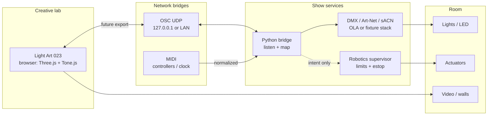
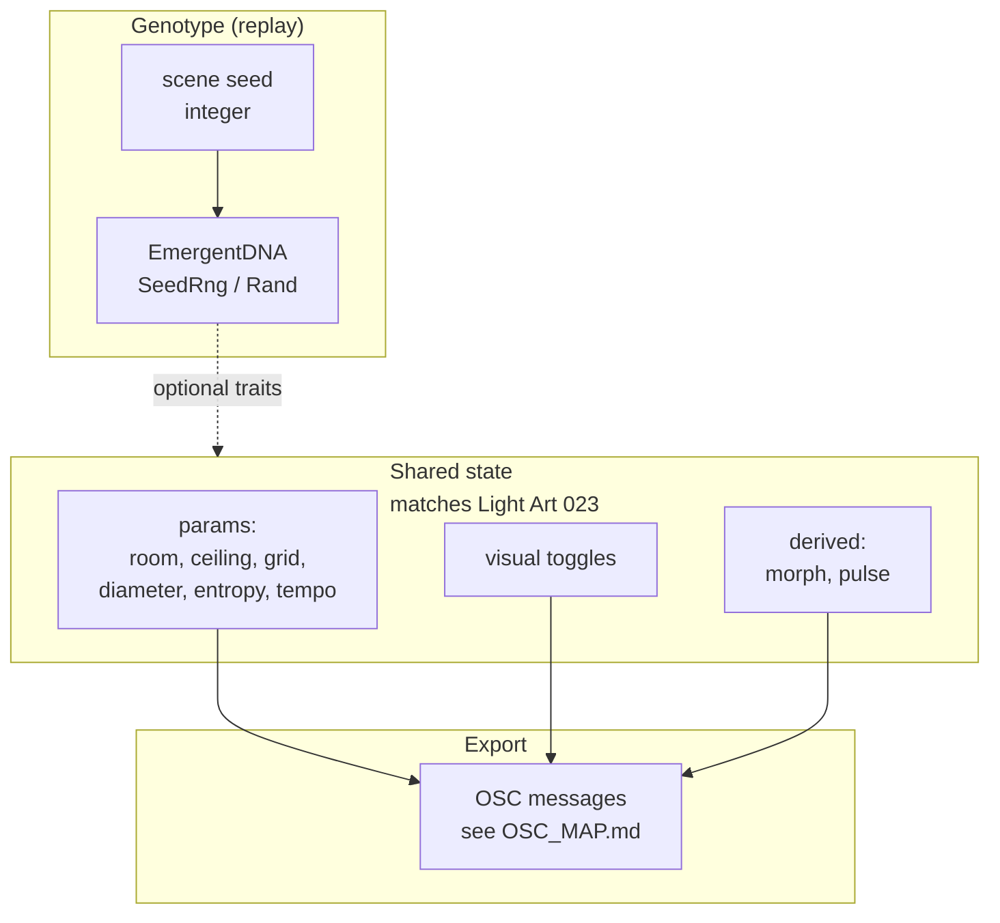
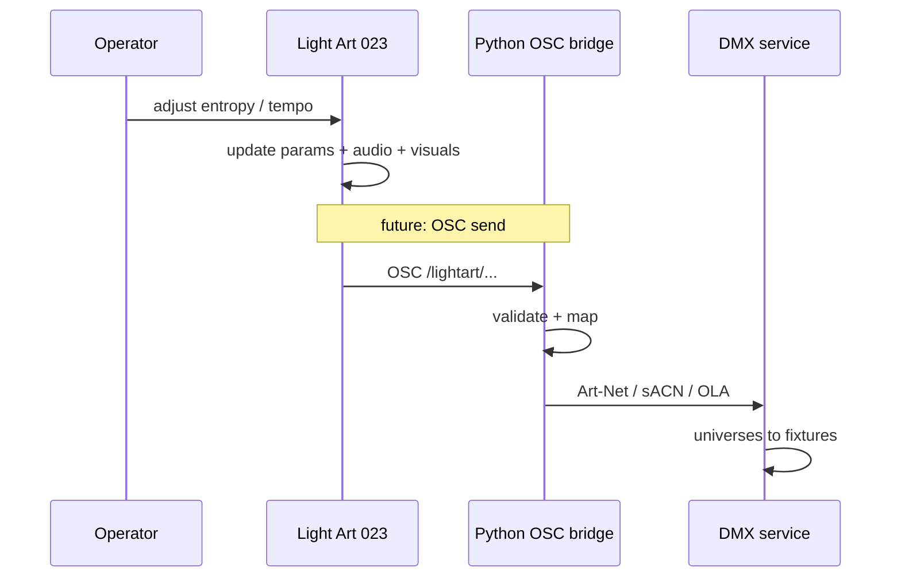

# Light Art OSC — data flow

**Studio:** Walhimer Studio · **Artist:** Mark Walhimer · **2026**

This document is the **living flow reference**. Update it when the bridge or hardware split changes.

---

## 1. System context

**Notes**

- **Light Art 023** stays the **phenotype preview**; it does not own DMX or motors.
- **Python** is the default place for **UDP OSC**, logging, and later **universe output**.
- **Robotics** never receives raw browser OSC alone; a **supervisor** enforces limits and estop.

---

## 2. Parameter and seed flow (target)

**Notes**

- **Replayable** randomness should go through **EmergentDNA**-compatible `Rand` when you need identical runs.
- **Live** jitter in the browser can stay non-deterministic; **recorded** OSC streams for sync should use agreed rules.

---

## 3. Message sequence (slider → room, future)

---

## Related files

| File | Role |
|------|------|
| [README.md](./README.md) | Stack and intent |
| [OSC_MAP.md](./OSC_MAP.md) | Address list (draft) |
| [bridge/](./bridge/) | Minimal OSC listen + test send |
