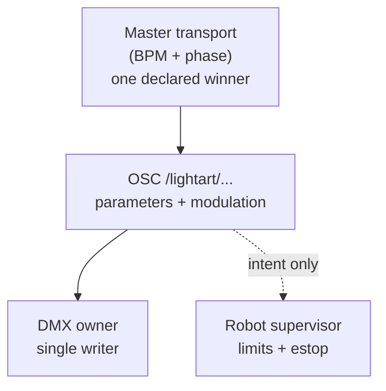

# Master clock & ownership

**Studio:** Walhimer Studio · **Artist:** Mark Walhimer · **2026**

This document defines **one authoritative timebase** for transport (musical time) and **who is allowed to command** DMX universes and robot motion. It is a **spec**; services (Python bridge, lighting engine, robotics supervisor) should implement these rules so nothing fights.

---

## 1. What “master clock” means here

| Term | Meaning |
|------|--------|
| **Transport** | Musical time: **tempo (BPM)**, bar/beat phase, start/stop. In Light Art 023 this is **`params.tempo`** driving `Tone.Transport`. |
| **Wall clock** | Real time (seconds) for **logging**, **timeouts**, **scheduled cues**—not the same as beat phase. |
| **Phase / modulation** | **`state.morph`**, **`state.pulse`** in 023—derived from elapsed time + tempo; good for shimmer, not for locking video frame-by-frame unless you add something stronger. |

**Master clock (v1 rule):**  
**Transport tempo** is owned by **one place at a time**:

1. **Default:** internal BPM from show state (same semantic as **`/lightart/tempo/bpm`** and Light Art 023 `params.tempo`).
2. **Optional override:** an external **MIDI Clock** (or Link, or LTC in a later revision) may become **master** if you explicitly enable “external sync” in config; then BPM/phase follow that source, and UI tempo becomes a **display** or **offset**—not a second competing clock.

**You do not** run independent BPM in the browser, in the Python bridge, and on the Roland **without** declaring which one wins. That is how drift and “two songs” happen.

---

## 2. How this maps to OSC (today)

- **`/lightart/tempo/bpm`** — **declared transport rate** for the show; should match whatever is driving audio when you are in sync mode.
- **`/lightart/morph`**, **`/lightart/pulse`** — **modulation outputs**, not a full timecode stream; fine for lights and atmosphere, not a substitute for **frame sync** to video walls unless you add **LTC/MTC** or **PTP** later.

**Future:** OSC bundles with **timestamps** (OSC 1.1 time tags) for **recorded** playback; live UDP may stay untagged for latency simplicity.

---

## 3. “Who owns DMX?”

**Ownership** = **only that process may write DMX universes** (or Art-Net/sACN) to the wire.

| Owner | Responsibility |
|--------|------------------|
| **DMX service** (recommended: **Python + OLA** or a dedicated lighting controller you configure once) | Subscribes to **OSC** or shared state, **maps** `/lightart/...` → channels/universes, applies **curves** and **fixture definitions**. **Sole writer** to DMX output. |
| **Browser / Light Art 023** | **Never** talks DMX directly. It may send **OSC** or mirror parameters only. |
| **MIDI** | May carry **faders** or **notes**; those values get **normalized** into parameters or OSC inside your bridge—MIDI does not “own” DMX unless you deliberately map a MIDI CC straight to a dimmer **in one documented path** (still ultimately one DMX writer). |

**Why it matters:** If two programs both output DMX, fixtures **flicker**, **fight**, or you get **impossible** states. One writer, one truth.

---

## 4. “Who owns robot safety?”

**Robotics ownership** is **not** the same as DMX.

| Owner | Responsibility |
|--------|------------------|
| **Robotics supervisor** (often on a **PLC**, **ROS safety stack**, **microcontroller with estop**, or vendor controller) | **Only** component that may **enable motion**, **set speed caps**, **enforce workspace limits**, and **honor estop / light curtains**. It receives **intents** (e.g. “go to pose”, “play macro 3”), not raw PWM from Max/OSC. |
| **OSC / creative layer** | Sends **high-level commands** (e.g. **`/lightart/robot/intent`** in [OSC_MAP.md](./OSC_MAP.md)) or JSON-in-OSC; **does not** bypass limits. |
| **Browser** | **Never** the safety authority; at most sends **requests**. |

**Why it matters:** OSC is **easy to spoof** on a network. Motors hurt people. **Safety** must live in **hardware or certified software** on the robot side, with **estop** always **local** to the machine.

---

## 5. One-page summary

---

## Related

| File | Role |
|------|------|
| [FLOW.md](./FLOW.md) | System diagrams |
| [OSC_MAP.md](./OSC_MAP.md) | Addresses |
| [README.md](./README.md) | Stack |
